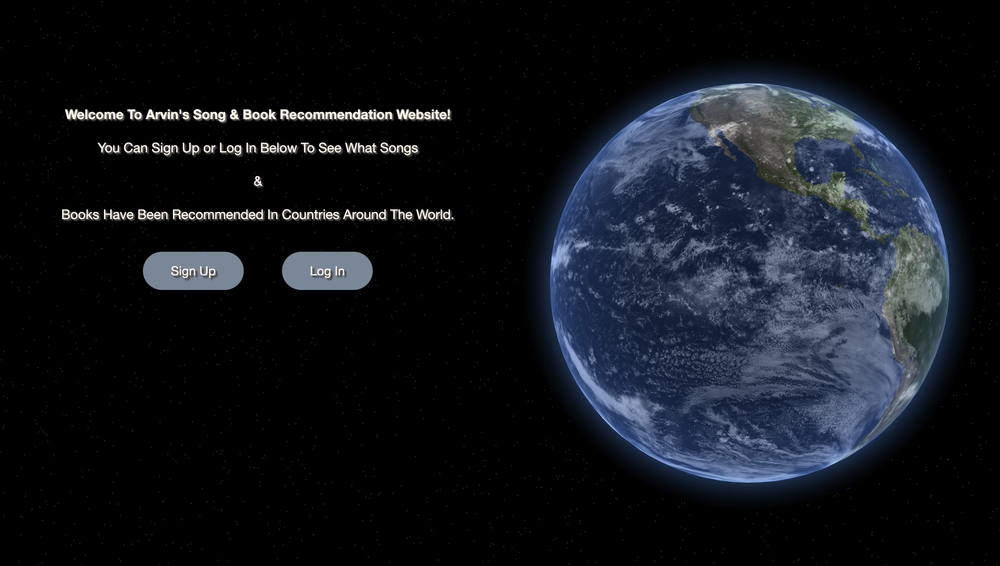
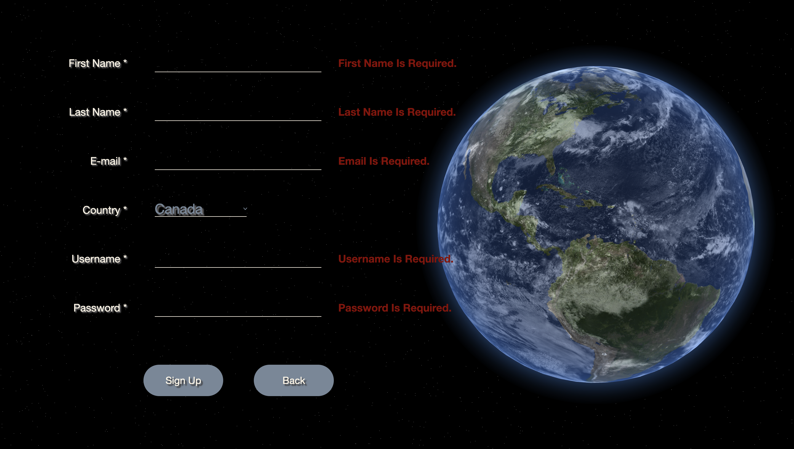
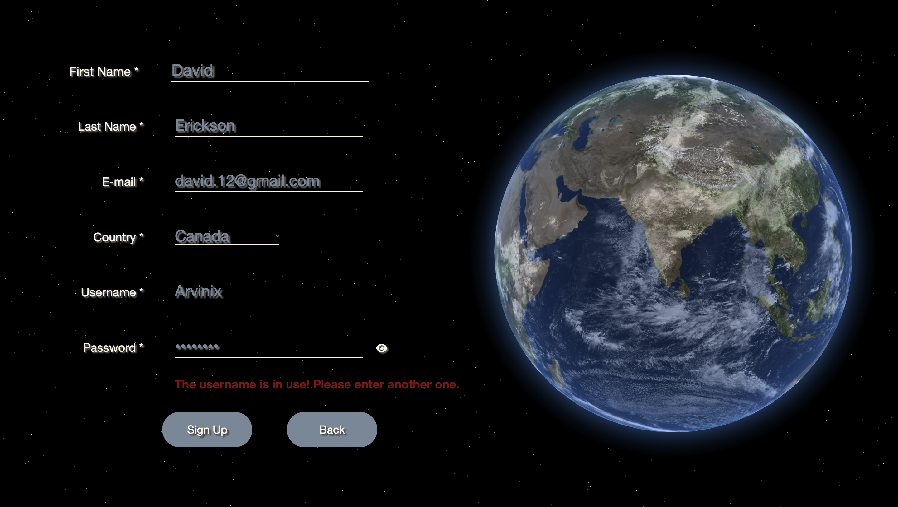
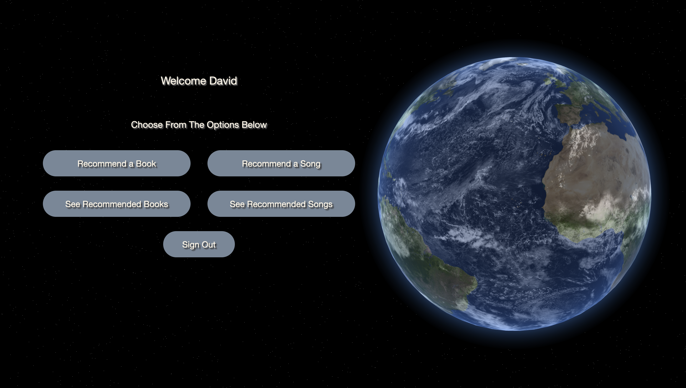
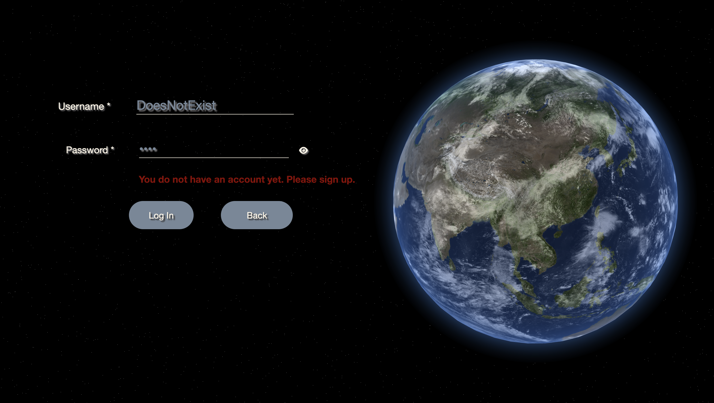
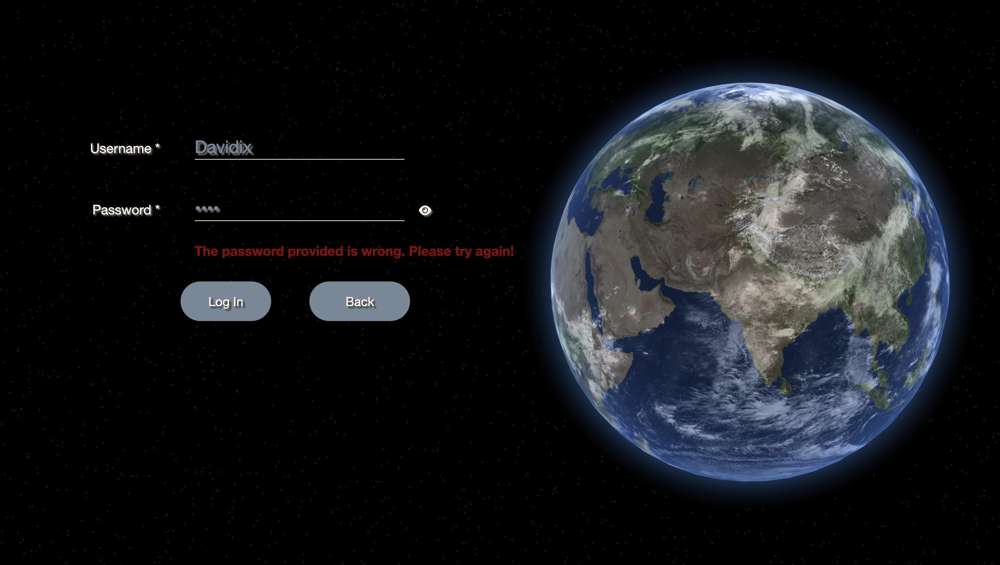
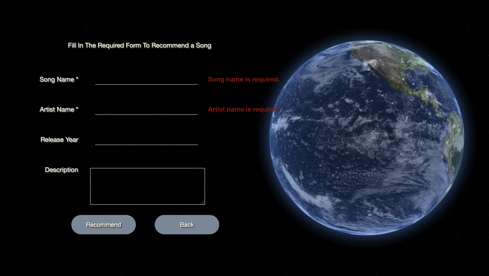
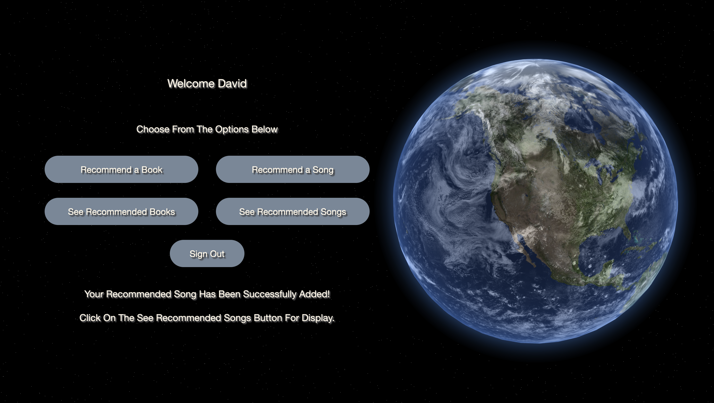
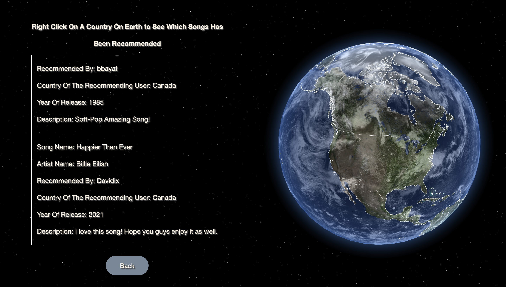
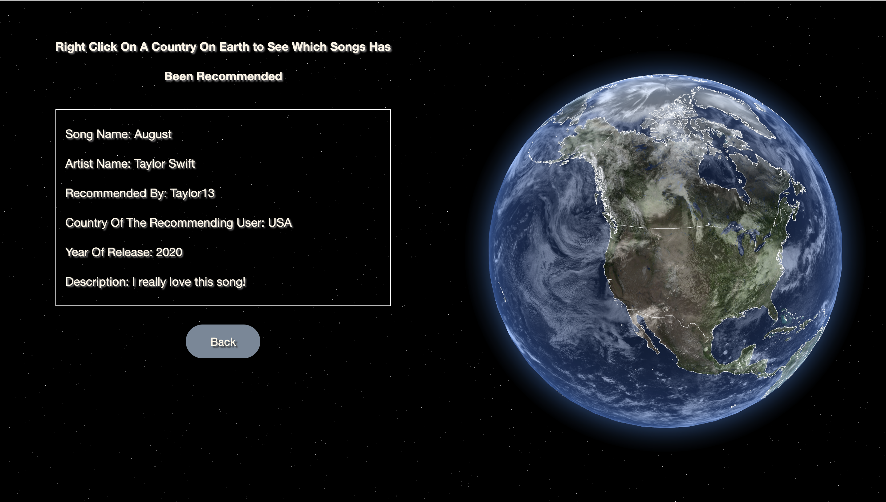

# Book & Song Recommendation Web Application

An interactive full-stack web application where users can sign up, log in, and recommend books and songs by country. Recommendations are visualized on a 3D interactive WebGL Earth globe — right-click any country to see what others have recommended from that region.



---

## Features

- **3D interactive Earth globe** — rendered with WebGL; left-click and drag to rotate, right-click a country to load its recommendations
- **Animated star background** — procedurally generated via custom GLSL vertex and fragment shaders
- **User authentication** — sign up and log in with username/password stored in `localStorage`
- **Book & song recommendations** — submit a book or song tied to your account's country
- **Country-filtered display** — recommendations are filtered by the country of the recommending user, shown in a dynamically built table
- **Form validation** — inline error messages for empty required fields, duplicate usernames, and wrong passwords
- **Password visibility toggle** — eye icon switches between hidden and visible password input
- **No backend database** — all state (users, books, songs) lives in the browser's `localStorage`; no server-side persistence required

---

## Tech Stack

| Layer | Technology |
|---|---|
| Runtime | Node.js + Express (static file server) |
| Frontend | Vanilla JavaScript (ES6 modules) |
| 3D Graphics | WebGL2 + custom GLSL shaders |
| Earth Texture | NASA 8K day map + cloud layer |
| Country Borders | GeoJSON (`countries.geojson`) |
| Styling | CSS + normalize.css |
| Persistence | `localStorage` |

> **Browser compatibility:** The custom GLSL star shaders currently run on **Firefox** and **Opera** only. Chrome/Edge may render without the star background.

---

## Project Structure

```
Book-Song-Recommendation-Web-Application/
  public/
    pages/          # HTML pages (index, login, signup, decision, book/song rec & display)
    scripts/        # ES6 module JavaScript
      earth.js            # WebGL globe geometry, textures, rotation
      display_earth.js    # GeoJSON border rendering + right-click country detection
      stars.js            # Procedural star background (GLSL shaders)
      user.js / user_controller.js
      book.js / book_controller.js
      song.js / song_controller.js
      book_song_recommendation.js
      book_song_display.js
      decision_page.js
      log_in.js / sign_up.js
    styles/
      styles.css
    files/
      countries.geojson   # Country border polygons for globe overlay
    images/               # Earth textures + README screenshots
  server.js               # Express app — serves static files
  package.json
```

---

## Getting Started

### Prerequisites

- **Node.js 20.x** or later
- **Firefox** or **Opera** (required for the GLSL star shader)

### Installation

```bash
git clone https://github.com/arvinbm/Book-Song-Recommendation-Web-Application.git
cd Book-Song-Recommendation-Web-Application
npm install
```

### Run

```bash
node server.js
```

Then open **http://localhost:3000** in Firefox or Opera.

---

## Usage

### 1. Sign Up

Create an account by providing your first name, last name, email, country, username, and password. Fields marked with an asterisk are required.

- Submitting with empty required fields shows inline error messages
- Duplicate email or username is detected and rejected
- Password visibility can be toggled with the eye icon





After successful sign-up you are redirected to the decision page.



---

### 2. Log In

Return users can log in with their username and password.

- Entering a username that does not exist shows a "no account" error
- Entering a correct username with a wrong password shows a "wrong password" error





---

### 3. Recommend a Book or Song

From the decision page, choose **Recommend a Song** or **Recommend a Book**. Fill in the required fields (name and artist/author) and optionally add a release/publication year and a description. Click **Recommend** to save.

- Submitting without required fields shows inline error messages
- On success you are redirected back to the decision page with a confirmation message





---

### 4. Browse Recommendations by Country

Click **See Recommended Songs** or **See Recommended Books** on the decision page. The globe loads with white country borders visible after a moment. **Right-click any country** to generate a table of all recommendations submitted by users from that region.





Currently supported countries for sign-up: **Canada**, **United States**, **Mexico**.

---

## Architecture

All data is managed client-side using three controller classes that serialize to and read from `localStorage`:

```
UserController  →  localStorage.userArray
BookController  →  localStorage.booksArray
SongController  →  localStorage.songsArray
```

Each controller follows the same pattern: the constructor hydrates from storage, `add*()` pushes and re-serializes, and `getAll*()` deserializes on demand. Page state (logged-in username, whether a book/song was just added) is passed between pages via URL query parameters.

The WebGL globe is split across three modules: `earth.js` handles geometry and textures, `display_earth.js` overlays GeoJSON country borders and maps right-click pixel coordinates to country names, and `stars.js` draws the procedural star field as a full-screen quad with a GLSL fragment shader.

---

## Bug Fixes

The following bugs were identified and fixed:

**1. `BookController.getAllBooks()` crash on empty state**
`JSON.parse(localStorage.booksArray)` threw a `TypeError` when no books had been added yet because `localStorage.booksArray` was `undefined`. Fixed by adding the `|| '[]'` fallback:
```js
// Before
return JSON.parse(localStorage.booksArray);
// After
return JSON.parse(localStorage.booksArray || '[]');
```

**2. `SongController.getAllSongs()` crash on empty state**
Same issue as above — `JSON.parse(localStorage.songsArray)` crashed when no songs existed yet. Fixed identically:
```js
// Before
return JSON.parse(localStorage.songsArray);
// After
return JSON.parse(localStorage.songsArray || '[]');
```

**3. Wrong cell label for book author in display table**
In `book_song_display.js`, the non-USA branch for books used `"Book Name:"` as the label for the author field instead of `"Author Name:"`. This caused the author's name to appear under a duplicate "Book Name" heading in the table.
```js
// Before
`Book Name: ${book._book_name} <br>
 Book Name: ${book._author} <br>`    // ← wrong label

// After
`Book Name: ${book._book_name} <br>
 Author Name: ${book._author} <br>`
```

**4. `songTable` shown instead of `bookTable` in the USA books branch**
In `book_song_display.js`, the USA-country special-case for the book display incorrectly called `songTable.style.display = "table"`. This meant the book table remained hidden even when a valid USA book recommendation was matched. Fixed to `bookTable.style.display = "table"`.

---

## Notes

- Clearing browser storage resets all users, books, and songs — there is no server-side persistence
- The application is deployed via Azure App Service (see `.github/workflows/`)
- Earth texture images are from NASA's publicly available 8K surface maps
